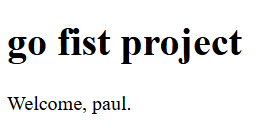

# go_firstProject

Just a tiny Go project I made to try out backend stuff.

It’s a basic server with two routes and a small HTML template.

Nothing wild, just me getting used to Go and how it handles web servers.

## How to run
go run main.go

The server starts on:
http://localhost:8080

## What it does

Serves a small homepage using a template

Has a simple /dev route

Mostly me learning how Go’s http package works
