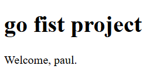

# go_firstProject

Just a tiny Go project I made to try out backend stuff although it’s a basic server with two routes and a small HTML template it is just here to getting used to Go and how it handles web servers.

---

## Tech Stack

- Language: Go
- Main libs/frameworks: (adding this soon)
- 

---

## Features

-  make the backend

- nothing really... yea this is it.

## How to run
go run main.go

The server starts on:
http://localhost:8080

---
